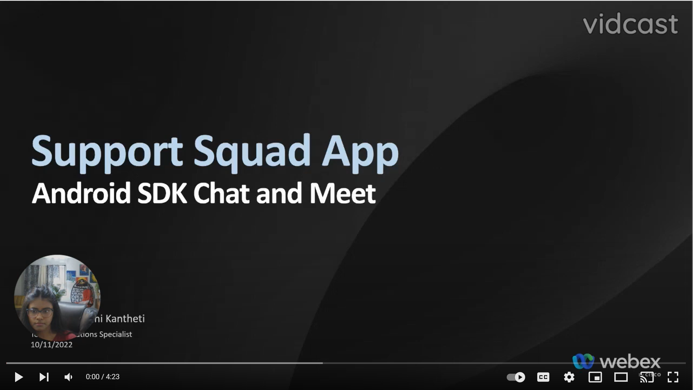

<!-- # Repo-Template
This is an Internal WXSD Template to be used for GitHub Repos moving forward. Follow the following steps: Visit https://github.com/wxsd-sales/readme-template/blob/master/README.md for extended details.
-->


<!--   Step 1) Name your repository: Names will ALWAYS start with "bot - ", "integration -", "macro -", or "supportapp -" 
Examples:"bot- <insert repo name>" 
       "integration - <insert repo name>"
       "macro - <insert repo name>"
       "supportapp - <insert repo name>" 

~3 words, kebab case, use words to indicate what it does. Visit https://github.com/wxsd-sales/readme-template/blob/master/README.md for details  
-->

<!--  Step 2) Add One sentence description to your repository: Copy/Paste from Webex Labs Card sentence.
       Example: "Redirect an Auto Attendant caller to an SMS conversation to alleviate Call Queue Agent responsibilities."
-->

<!--  Step 3) Use following Template to copy/paste your details below -->

# Chat And Meet Support Assistant
 Welcome to our WXSD DEMO Repo! <!-- Keep this here --> 
 
Connect to a professional with a provided instant chat and video calling assistance.

This Webex Android SDK based support app connects you to a professional and provides instant chat and video calling assistance. This demo connects users with experts in various fields to help them resolve issues they may be facing. The app has a user-friendly interface, making it easy for users to find the right expert to solve their problems.

[](https://www.youtube.com/watch?v=nbPmM90voP0, "Chat and Meet Support Assistant")


## Table of Contents
<!-- ⛔️ MD-MAGIC-EXAMPLE:START (TOC:collapse=true&collapseText=Click to expand) -->
<details>
<summary>(click to expand)</summary>
    
  * [Overview](#overview)
  * [Setup](#setup)
  * [Demo](#demo)
  * [License](#license)  
  * [Disclaimer](#disclaimer)
  * [Questions](#questions)

</details>
<!-- ⛔️ MD-MAGIC-EXAMPLE:END -->


## Overview

On opening the application, you will have an option to login as a Webex user or continue as a guest. After logging in, by clicking on the chat button, you will be prompted to enter your details (name, email, phone number) and select what you are looking for. By clicking on the "Go" button, you will be logged in as a guest and will be directed to the space with the associated agent. Here, you can send messages and share content like images, videos and files. You can additionally view your files in the contents tab or start a video call with an agent, if wanted. During the video call there are multiple options available, for example mute audio, mute video, share screen, put call on hold, view the participants etc. After exiting, you can start a new chat if wanted or click on the logout button to go back to the login screen. When logging in as a Webex user, you have an option to rebrand the application by changing the background image or changing the "Looking for info" drop down menu along with the associated agents.

## Setup

### Prerequisites & Dependencies:

- Mobile Integration with valid client ID and client secret. Please refer [Webex Developer Site](https://developer.webex.com/docs/integrations#registering-your-integration) to see how to register your integration.
- Android Studio 4.0 or above (recommended)
- Webex Android SDK version >=3.4.0
- Android SDK Tools 29 or later
- Android API Level 24 or later
- Java JDK 8
- Kotlin - 1.3.+
- Gradle for dependency management

<!-- GETTING STARTED -->

### Installation Steps:
1.  Download or clone this git project and open it in your android studio IDE
2.  Include all these constants in your gradle.properties file
    ```
    CLIENT_ID=""
    CLIENT_SECRET=""
    SCOPE=""
    REDIRECT_URI=""
    ```

3.  Add the following repository to your top-level `build.gradle` file:

        allprojects {
            repositories {
                maven {
                    url 'https://devhub.cisco.com/artifactory/webexsdk/'
                }
            }
        }

4.  Add the `webex-android-sdk` library as a dependency for your app in the `build.gradle` file:

        dependencies {
            implementation 'com.ciscowebex:androidsdk:3.4.0@aar'
        }
        
5.  Run this project on android emulator or on local device
    
    
## Demo

<!-- Insert link to the website below (if deployed) and/or to the YouTube/Vidcast video. -->

Check out our live demo, available [here](<https://www.youtube.com/watch?v=nbPmM90voP0>)!

<!-- Keep the following statement -->
*For more demos & PoCs like this, check out our [Webex Labs site](https://collabtoolbox.cisco.com/webex-labs).

## License
<!-- MAKE SURE an MIT license is included in your Repository. If another license is needed, verify with management. This is for legal reasons.--> 

<!-- Keep the following statement -->
All contents are licensed under the MIT license. Please see [license](LICENSE) for details.


## Disclaimer
<!-- Keep the following here -->  
 Everything included is for demo and Proof of Concept purposes only. Use of the site is solely at your own risk. This site may contain links to third party content, which we do not warrant, endorse, or assume liability for. These demos are for Cisco Webex usecases, but are not Official Cisco Webex Branded demos.


## Questions
Please contact the WXSD team at [wxsd@external.cisco.com](mailto:wxsd@external.cisco.com?subject=chat-and-meet-support-assistant) for questions. Or, if you're a Cisco internal employee, reach out to us on the Webex App via our bot (globalexpert@webex.bot). In the "Engagement Type" field, choose the "API/SDK Proof of Concept Integration Development" option to make sure you reach our team. 

